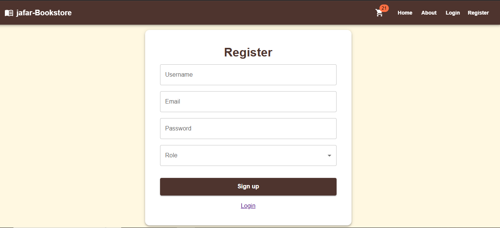

# 📚 Bookstore Inventory Management System

A robust **full-stack application** designed to manage a bookstore's inventory. It features **role-based authentication** for Admins and Staff, allowing for secure and efficient management of book stock, pricing, and details.

## 🌟 Technologies

This project is built using a modern stack, leveraging the speed of React and the reliability of Node.js with MySQL for data persistence.

| Category | Technology | Description |
| :--- | :--- | :--- |
| **Frontend** | **React (Vite)** | Fast, modern framework for a dynamic user interface. |
| **UI Library** | **Material UI (MUI)** | Professional, responsive component library for a clean design. |
| **Data Fetching** | **Axios, React Router** | Handling API calls and client-side navigation. |
| **Backend** | **Node.js & Express** | Scalable server environment for API endpoints. |
| **Database** | **MySQL** | Relational database for structured inventory data. |
| **Security** | **JWT Authentication** | Secure token-based access control and **Role-based Access Control (RBAC)** middleware. |

***

## 🚀 Key Features

The application provides distinct user experiences based on role, ensuring security and proper access control.

### 👨‍💼 Admin Features (Full Access)

| Functionality | Description |
| :--- | :--- |
| **Inventory CRUD** | Add new books (title, author, genre, price, stock). |
| **Update Details** | Edit existing book details (price, shelf number, etc.). |
| **Stock Management** | Add new stock or directly manage book quantities. |
| **Deletion** | Remove books from the inventory entirely. |
| **View All** | Comprehensive view of all books and their stock levels. |

### 👩‍💻 Staff Features (Limited Access)

| Functionality | Description |
| :--- | :--- |
| **Search & Filter** | Efficiently search for books by **title, author, or genre**. |
| **Location Update** | Update book shelf numbers. |
| **Stock View** | View available stock and all book information. |

***

## ⚙️ Installation & Setup

Follow these steps to get a copy of the project running on your local machine.

### 1. Clone the Repository

```bash
git clone [https://github.com/Hena-yaris/bookstore-app.git]
cd bookstore-app


### 2. Install Dependencies
Install dependencies for both the backend server and the frontend client.

```bash
Backend
cd backend
npm install

Frontend
cd ../client
npm install

###3. Database Setup (MySQL)
Create a MySQL database (e.g., bookstore_db).

Update the connection details in your backend environment variables (or configuration file).

Run migrations to create the necessary books and users tables.

###4. Run the Application
Execute the following commands from their respective directories to start the full-stack application.

Backend
# From the /backend directory
node server.js 
# (Note: Use your actual start command, e.g., 'node server.js' or 'npm start')
Frontend
# From the /client directory
npm run dev
The frontend client should open in your browser, and your API will be running on its configured port.


###📸 Screenshots




###🔮 Future Improvements
We plan to enhance the application with the following features:

Pagination & Sorting: Implement server-side pagination and sorting options for large book lists.

Image Uploads: Add functionality for uploading and managing book cover images.

Activity Logs: Implement user activity logs for tracking all inventory changes and history.


###🧑‍💻 Author
Passionate about technology, design, and building efficient full-stack applications.

[https://github.com/Hena-yaris]


